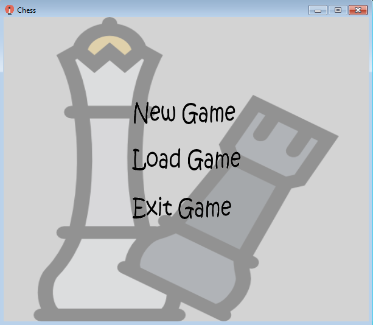
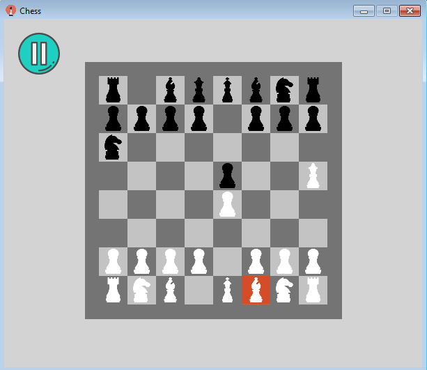
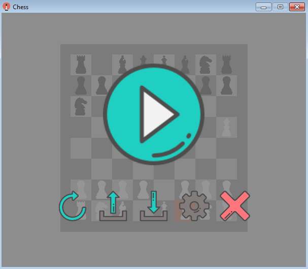
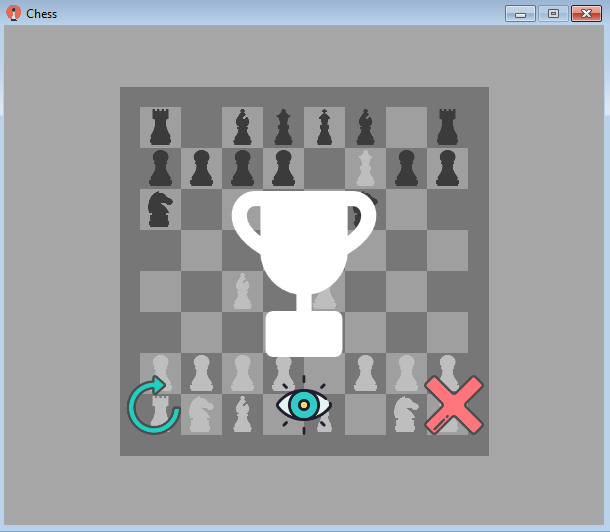

# Chess game.

In this project chess game has been made. 

At current moment, game has been implemented only for two players (I didn't wrote bot for a single player - may be I'll do it later).
If you want to find more information about this game, it's rules you can visit [Wiki Link](https://en.wikipedia.org/wiki/Chess).

## Getting Started.

To play this game, or use it as the base for your own project, first thing you need to do - is just to clone it into your local repository.

If you want to deploy this solution on your local machine for development or testing purposes you need to do next things:
*  First thing, you need to do - is to compile Chess game content. 
To do this step, you need to go to Content folder, find Monogame execution file: ChessContent.mgcb, double click on it, and as it loaded press F6. 
* After your content compilation process will be finished - open solution file in Visual Studio.
* Build the project by right click on the Project title in solution explorer or press Ctrl+Shift+B.
* To run the project, click Start button in Visual Studio menu or Ctrl+F5.

### Prerequisites.

To deploy or run this solution you need:
* [Visual Studio 2015] (https://www.visualstudio.com/ru/downloads/) - an integrated development environment (IDE) from Microsoft used in this pgoject.
* [Monogame for Visual Studio 2015] (http://www.monogame.net/downloads/) - software used to make Windows and Windows Phone games used in this pgoject.

### Examples and game Screenshots.

In this section You could watch screenshots of the implemented game.

First of all when you double click on game executed file Chess.exe you will see Main Chess Game menu. In the Main menu you'll see three buttons:
* New Game button - click on this button creates a new game.
* Load Game - this button click loaded the last saved Chess Game. (Possibility of choosing loaded game will be implemented later).
* Exit Game - click on this button lead to the game leaving.

If You decide to choose and click New Game button you will see the Main Game window with:
* Chess Board, witch allows players to make their own game steps.
* Pause Button - allows to stop the game for a some time.

On the left side of the Main Chess Game Window you could press on Pause button, it will lead you to the next Pause menu.
In this menu you can see six different buttons:
* Resume game button - allows you to continue your game.
* New Game button - removes all your currently achieved game results and initialize a new Chess Game.
* Load Last Saved Game button - allows you to load your last saved game.
* Save Game button - saves Your current game progress to XML file.
* Settings button - allows you to change properties of Chess game (Not yet implemented).
* Exit Game button - lead to the Chess Game exit. You loose all unsaved achievements.

If one of two players has won (set checkmate to another person), players will see next Win Game Menu, where:
* Big trophy with color depending on the color of winner. White trophy if white player has won, black trophy otherwise.
Three buttons:
* New Game button - initialize new game.
* Watch button - button click on which allows to see clear chess board. Because of the winner trophy, did not allow players to see checkmate posotion, You could simply click on this button and see your chessboard with checkmate position. 
* Exit Game button - button ckick leed to the Chess Game Exit.

So, in this section I tried to make an overview all Chess Game menus and describe all on button click actions.

## Authors.

* **Zakharov Aleksey** - *Initial work* - [PurpleBooth](https://github.com/ZakharovAleksey)
